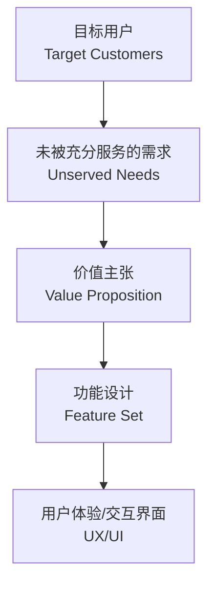
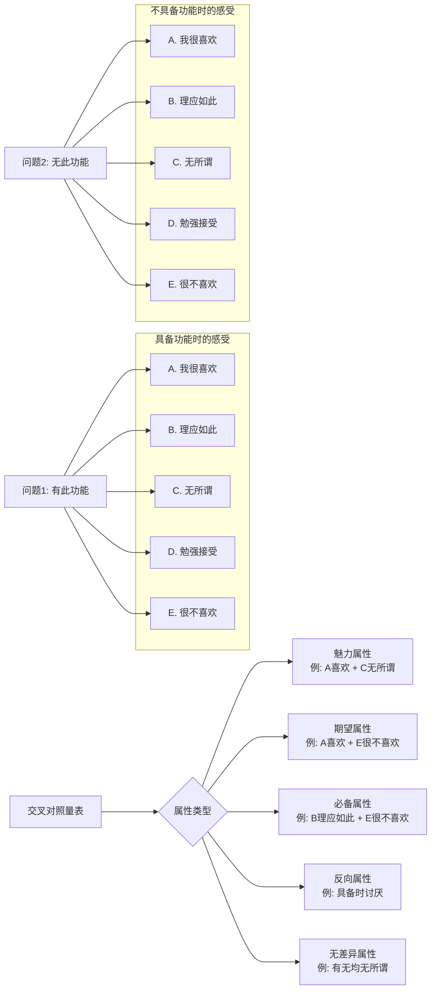
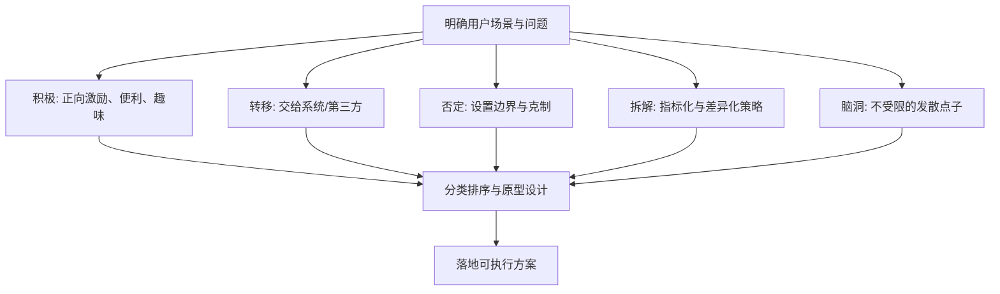
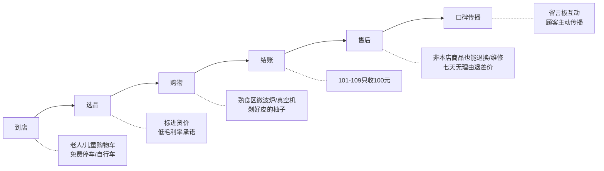

# 产品经理需求分析课程 — 课后笔记

> 视频作者： | 平台：text | ❤️ 0
> 转录：本地 Whisper（详细模式 · 3 段并行处理）

---

## 产品与需求：核心思维
### 产品的本质是满足需求
> 产品就是指能够供给市场被人们使用和消费，能满足人们需求的任何东西。它可以是有形的物品，无形的服务组织观念或它们的组合。

在当今商业市场中，“供给市场”和“被人们使用消费”已经是大多数产品默认满足的前提，真正的关键差异在于**能否满足人们的某种需求**。这就是 PMF（Product Market Fit，产品市场匹配）模型的基础。

### PMF 模型：从需求到功能
整个产品的构建是一个自下而上的过程，底层是需求，顶层才是界面。

> 一个交互界面，它绝对不是一个产品……不要痴迷于某些具体的功能。这些东西是必要的，但绝对不是一个产品的本质。

**案例**：12306 早期界面体验非常粗糙甚至反人性，但它真实满足了“春节回家买票”的核心需求，用户仍然愿意花大量时间守候刷新。
> 产品最核心的一定要考虑到需求，需求本身就是所有产品最基础、最核心的那一颗柱石。

这一逻辑不仅适用于产品，也适用于职场和个人发展：**满足对方的需求（企业、部门、合作伙伴）才是达成合作、顺利发展的最关键要素。**

---

## Kano 模型：需求的量化分类工具
### 为什么需要 Kano 模型
工作中大量的痛苦源于“高付出、低回报”，而根源经常是我们做了不产生实际业绩的事。Kano 模型的价值在于：
- 确认需求是否客观存在
- 判断需求的优先级高低
- **减少无用功，排除 95% 不产生收益的付出**

> 我酷爱量化模型，因为量化模型可以让我们非常精准的、数字化的，像一种科学一样解释很多的问题。

### Kano 模型的五大属性
该模型将需求分为五个层次，每一类对用户满意度的影响截然不同。

| 属性类型 | 提供该需求时 | 不提供该需求时 | 产品实例 |
|:---|:---|:---|:---|
| **必备属性** | 满意度不提升（觉得应该）| 满意度大幅下降 | 视频 App 的流畅播放 |
| **期望属性** | 满意度提升 | 满意度降低 | 视频平台的内容丰富度 |
| **魅力属性** | 满意度大幅提升（惊喜）| 满意度不降低 | 微信红包、综艺的创新赛制 |
| **反向属性** | 满意度下降 | – | 广告、收费 |
| **无差异属性** | 满意度不变 | 满意度不变 | 某些使用率极低的附加频道 |

> 必备属性是构成我们任何一款产品最关键的一个底线。很多时候，我们过于追求产品的上限，而忽略了产品的底线。

#### 属性解析
- **必备属性**：优化超出阈值后用户无感，但缺失会立刻抛弃产品。必须做好，因为它决定产品“能不能用”。
- **期望属性**：确定性最高，做就有提升，不做就下降，是最值得投入资源优化的区域。
- **魅力属性**：可遇不可求，无法用固定方法论设计出来，但一旦出现就能形成口碑传播和品牌心智。内容产业中，魅力属性往往决定宣发的生与死。
- **反向属性**：分两种——与商业模式无关的“损人不利己”功能必须立刻删除；与商业模式有关的（如广告）要尽量做得**更柔和**（提醒用户、显示剩余秒数等）。
- **无差异属性**：用户根本不在乎，资源和生命最大的浪费区，应果断放弃。

> 不要在无差异属性上浪费时间。我们太多的时间，太多的生命，太多的产品资源，其实都是在无差异属性上凭空浪费掉了。

---

## 如何判断一个功能属于哪类属性
### 两个问题，一张量表
通过同一功能在“有”和“没有”两种情况下用户的感受，交叉定位属性。
- **问题 1**：如果产品**具备**该功能，你的感受是？
- **问题 2**：如果产品**不具备**该功能，你的感受是？

选项：A. 我很喜欢  B. 理应如此  C. 无所谓  D. 勉强接受  E. 很不喜欢

将两个答案组合后，对照下表得出属性：


**实际判断示例**：
- 微信朋友圈：
  - 有朋友圈 → 我很喜欢（A）
  - 没有朋友圈 → 很不喜欢（E）
  - 结果：A+E → **期望属性**
- 微信朋友圈（另一种认知）：
  - 有朋友圈 → 理应如此（B）
  - 没有朋友圈 → 很不喜欢（E）
  - 结果：B+E → **必备属性**

> 有你很喜欢，没有你很不喜欢，这是期望属性；有你认为是应该的，没有你很不喜欢，这是必备属性；有你很喜欢，没有你无所谓，这就是魅力属性。

---

## 需求优先级排序与产品策略
基于 Kano 模型的实践优先级：
1. **先保证必备属性** —— 产品的底线，破坏底线一切归零。
2. **再优化期望属性** —— 确定性最高的体验提升路径。
3. **挖掘魅力属性** —— 拉开竞争差距、形成自传播的关键，但不可强求。
4. **剔除无商业价值的反向属性** —— 损人不利己的立即砍掉；必须保留的（如广告）尽量做得柔和。
5. **坚决不在无差异属性上投入** —— 节约最大量的资源。

通过这样的分类与排序，可以极大减少工作中的“高付出低回报”，让产品决策更精准、更科学。

> 我们每个人在职场上也是一种产品。满足业务需求之后，我们的职业发展才会更加顺利和容易。
## Kano 模型进阶：需求优先级排序与问题拆解方法

### 一、Kano 模型属性分类回顾

通过二维问卷（提供该功能/不提供该功能）和五级量表（我很喜欢、理应如此、无所谓、勉强接受、我很不喜欢），可以将需求归入不同属性类别。

在介绍会员系统的案例中，强调了认知同步的重要性：
> 任何一个产品，如果说当用户的周知度不够的时候，你需要让用户先同步你的认知，再让他去做出合理的判断。

### 二、多人调研结果的统计与优先级计算

当面对多用户、多需求的复杂情况时，仅靠属性分类不足以确定开发顺序，需要引入定量计算。

#### 1. 比例计算与属性归类
针对某一功能，将所有用户的选择结果归入 A (魅力), O (期望), M (必备), I (无差异) 四类，并计算各部分所占百分比。占比最高的属性即为该需求的最终归类。

#### 2. Better-Worse 系数计算
引入 Better-Worse 系数，量化某一功能对用户体验的影响程度，用于在同类属性中进一步排序。

- **Better 值 (SI)**：增加该功能后的满意度提升程度。
  计算公式：
  ```
  SI = (A + O) / (A + O + M + I)
  ```
  本质是 “魅力 + 期望” 占总体的比例。

- **Worse 值 (DSI)**：不提供该功能后的满意度下降程度。
  计算公式：
  ```
  DSI = (M + O) / (A + O + M + I) * (-1)
  ```
  本质是 “必备 + 期望” 占总体的比例，取负数表示负面体验。

计算逻辑的解读：
> 所有的产品都是在趋利避害。Better...是增加这个功能之后体验改善的高点。Worse...是去掉这个功能功能体验的降低。这个的差值，其实就是我们应该去考虑应该放在哪个象限的事。

```mermaid
graph TD
    A[收集问卷数据] --> B{功能评价分类};
    B --> C[魅力属性 A];
    B --> D[期望属性 O];
    B --> E[必备属性 M];
    B --> F[无差异属性 I];
    C & D & E & F --> G[计算Better-Si系数];
    G --> H[公式: (A+O) / (A+O+M+I)];
    C & D & E & F --> I[计算Worse-Dsi系数];
    I --> J[公式: -(M+O) / (A+O+M+I)];
    H & J --> K[用于后续四象限排序];
```

#### 3. 多需求优先级排序四象限
当有多个需求（如功能1-5）需要排序时，通过各需求的 Si 和 Dsi 构建四象限图来比较优先级。

- **横坐标原点**：所有需求 Si 值的**平均值**。
- **纵坐标原点**：所有需求 Dsi **绝对值**的**平均值**。

排序原则：
> ...我们的资源永远是不够的...在这个体系中，你就要去思考，先要去做的是在必备属性的部分。而在同一个属性中，我们要去优先做better值更高的需求。

**优先级排序法：**
1.  **象限顺序**：必备属性 > 期望属性 > 魅力属性 > 无差异属性（不做）。
2.  **同象限内**：优先做 Better 值（SI系数）更高的需求。

**举例排序结果**：若功能4、5、2、1、3分布在坐标轴中，排序应为 `4 -> 5 -> 2 -> 1 -> 3`。

```mermaid
quadrantChart
    title 需求优先级四象限图
    x-axis Worse系数低 --> Worse系数高
    y-axis Better系数低 --> Better系数高
    quadrant-1 期望属性 (优先做)
    quadrant-2 魅力属性 (次优先)
    quadrant-3 无差异属性 (不做)
    quadrant-4 必备属性 (最优先)
    “功能4”: [0.6, 0.8]
    “功能5”: [0.7, 0.75]
    “功能2”: [0.3, 0.7]
    “功能1”: [0.2, 0.6]
    “功能3”: [0.4, 0.3]
```

### 三、需求挖掘与确认五步法总结

通过以上过程，总结出系统性的需求分析框架：
1.  **提出问题**：设计具备和不具备该功能时的双问题问卷。
2.  **量化感受**：采用五级李克特量表收集用户态度。
3.  **交叉归类**：将单个用户的答案映射到A/O/M/I属性表格中。
4.  **统计分析**：汇总多人数据，计算各类属性占比和Better-Worse系数。
5.  **综合比较**：将多个需求的系数放入四象限中，确定最终优先级。

### 四、Kano模型的核心价值：避免无用功

Kano模型的核心在于识别并避免占用大量资源却对用户影响甚微的“无差异属性(I)”。

> 职场人的一个最大痛点就是加班，而加班比加班更痛的是什么？是加班之后业绩本质上并不提升...其实因为你通过这样一张卡诺的量表就能看到，其实最多的板块是这个I...无差异属性...从概率上讲，我们很多的时刻做的事情都没有特别大的价值。

核心应用建议：对于任何任务，都可以用Kano思维扪心自问，思考它的真实价值，把时间用在高价值的地方。

### 五、案例拆解：微信体验优化分析

以微信为例，运用Kano模型分析大型产品的核心路径和优化点。

- **核心路径**：好友关系 (必备) -> 聊天沟通 (必备) -> 聊天功能 (集合体)。
- **分析结论**：
  - **必备属性 (M)**：好友关系、一对一聊天、群聊、文字消息。这类功能是根基，难以通过优化大幅提升体验。
  - **魅力属性 (A)**：红包（有阶段性）。难以复制，做好了能惊喜，但用户感知变化快。
  - **期望属性 (O)**：视频、通话、自建表情、公众号内容。这是最值得优化的区域，做得好体验显著上升，做不好则会下降。
  - **无差异属性 (I)**：掷骰子、摇一摇等边缘功能。不应在此浪费资源。

> 期望属性是我们一些最容易去做优化的点的...我们其实找到一个产品能够去优化的点，一定是先找到什么样的地方是可以优化的，再通过这个点的合理的路径拆解，找到他应该去做的事，这个东西叫做有的放矢的一套打法。

### 六、优化方法论：HOW MIGHT WE (HMW)

HMW 是一种将问题转化为解决方案的框架式头脑风暴方法。
- **核心理念**：
  - **H (假设)**：假设所有问题都可被解决。
  - **M (暗示)**：无需完美，只要有方向性想法即可。
  - **W (宽广)**：解法是无限的，可以大胆创新。
  - **V (协作)**：借助团队甚至整个公司的资源。

- **HMW 五步法**：
  1.  **明确用户、场景与问题**：如“为25-35岁微信普通用户，在群聊场景下，解决因公众号内容标题党严重导致信息有效率低下的问题”。
  2.  **问题拆解 (开脑洞)**：运用 **“积极、转移、否定、脑洞、拆解”** 等维度的强制框架进行思考，**此阶段不考虑可行性**。
  3.  **发散思维**：进行头脑风暴。
  4.  **分类排序**：对想法进行整理。
  5.  **流程与原型设计**：落实具体方案。

- **“积极”维度的拆解示例**：
  如何通过给用户好处来促使其转发精准内容？可以从以下方向强制打开思路：
  1.  **给用户好处**：转发精准的公众号内容有红包、积分奖励或可参与抽奖。
  2.  **给用户方便**：优化分享流程或内容格式。
  3.  **让体验有趣**：引入游戏化或其他趣味性互动方式。
## 一、HMW 五步法：将需求转化为可执行方案

HMW（How Might We）是一种系统的发散与聚焦工具，通过五个固定环节，帮助团队从“找到问题”过渡到“设计解决方案”。五个环节分别是 **积极、转移、拆解、否定、脑洞**。

### 1. 积极（Positive）  
通过正向的激励、便利和有趣体验，让用户主动完成我们期望的行为。

> 可以通过这样的一些方式反向的给用户刺激，与他的一些激励使得，比如说转发了精准公众号有红包……或者我们可以用一些生态性的打法，例如你的公众号的作者……可以用一种类似于广告付费的方法给到这些传播者。

> 给用户方便，怎么给用户方便？比如说我们可以通过语音来去搜索群内的公众号……可以通过一些方式帮助用户过滤掉与主题不相符的内容……做一些自动屏蔽，其实这无疑是给用户方便的一种体系。

> 让体验更加有趣，那对于群内发一个内容，大家可以对于他进行采和赞，对标题党信息，比如说群主可以给他关一个小黑屋等等。

- **核心思路**：红包激励、付费转发、积分抽奖、语音搜索、智能过滤、互动投票等。
- **卡诺模型视角**：多数属于“魅力属性”，做了会带来惊喜，不做也不会被责备。

### 2. 转移（Transfer）  
将问题从用户身上转移给系统或第三方，降低用户的操作负担或选择成本。

> 转移的逻辑呢，是你不去做这样一个事情，或者叫做不需要用户去做这样一个事情，而是把这样一个问题交给第三方，或者交给系统来去解决。

> 如何通过一些系统的方法来去对于用户进行在这个群内的一些 push？……让用户乐于主动找到符合群内调性的精准公众账号……通过不同操作维度进行更加细致的运营，表征其相应的权力。

- **系统代劳**：内容推荐、精准 push、权限分层，让群管理者与系统共同维护内容质量。
- **本质**：用产品机制替代人力判断，减少用户的决策疲劳。

### 3. 否定（Negation）  
刻意设置边界与克制，通过“不让做某事”或“必须做某事”倒逼内容质量与真诚度。

> 否定是什么？……叫做让用户不得不……让用户在去转发一条内容的时候，他必须要去写出来他相应的推荐语。可能你会觉得这件事他不合理，但是我们先把这个框架撑出来。

> 如何能够让用户不去转发……依然能够通过群内的其他系统故事，或者其他方式，也能够看到和聊天上下文相关的内容。

- **强制推荐语**：提升转发门槛，过滤低质分发。
- **关闭转发**：通过上下文推荐等替代路径，保证内容触达，同时避免刷屏。
- **意义**：否定不是简单的拒绝，而是用边界感塑造产品价值与秩序。

### 4. 拆解（Deconstruction）  
将模糊的“精准”“匹配”拆解为可度量的指标与差异化策略，避免凭感觉决策。

> 所谓的拆解的话就是我们要去思考什么才是精准的内容，什么才是精准的匹配……所谓的并不精准，有可能是我们点进去之后，它一条内容的完整观看的比例非常低，也有可能是它打开之后停留时长非常短。

> 一部分人看的时长非常长，另外一部分人看的时长非常短……可能就需要对于不同的人群打上相应不同的标签，再发送一个内容之后，根据协同过滤或相关性算法进行详细匹配。

- **关键指标**：完读率、停留时长、互动深度。
- **策略分化**：对低质内容系统性降权，对不同人群打标签，实现“千人千面”的精准匹配。
- **核心点**：从感性判断走向数据驱动的策略拆解。

### 5. 脑洞（Brainstorm）  
不受任何约束，将天马行空甚至一厢情愿的念头全部放入，为方案储备突破性灵感。

> 所谓的脑洞拆解的话，就是我们不要受任何前面的这样一些约束，任何一个你可以去想到的一些方式……转发非精准内容，系统识别之后，自动屏蔽别人看不到，但是自己还认为自己发出去了，再过一段时间可能给这类的用户进行一个在评分上的降权。

- **案例**：幽灵屏蔽、信用分降权、跨群行为限制等。
- **要点**：先发散后收敛，脑洞阶段不设“不可能”。

### HMW 五步流程图


这五个步骤构成一套完整的思考体操，从多个维度将需求展开，再通过后续的分类、排序、流程和原型设计收敛为实际产品方案。

## 二、案例拆解：胖东来的差异化体验与服务链路

### 背景与传奇色彩
胖东来是一家扎根河南许昌、新乡的区域零售企业，1995年创立。其发展历程中既有至暗时刻，也有被顾客“用钱投票”的高光。

- 1998 年遭遇恶性纵火，损失 300 多万，8 名员工遇难。
- 老顾客主动借钱，一位大娘拿出两万养老钱：“可别趴下”。
- 2005 年进入新乡，周围是沃尔玛等巨头，无人看好的位置却让竞争对手相继退出。
- 2016 年新商场开业仅一小时因人流量过大被迫暂停营业，警察维持秩序。

### 极致服务与透明定价
胖东来将大量服务做成了“魅力属性”，成就了现象级口碑。

> 价格公开透明，它在它的所有标价上标上进货价。公开自营产品的毛利率最高只得有 20%，未来不允许超过 25% 的毛利率。

> 服务体验……购物车有七种样式，有老人和儿童款……免费修衣服，家电，维修珠宝清洗，不是在胖东来买的也可以享受服务。熟食区配微波炉方便加热，还有真空机可以打包带走，雨伞充电宝免费的租借……柚子皮帮你剥开……七天无理由退差价。

**员工福利同样溢出**：不允许加班，工资翻倍，每天工作 6 小时，管理层每年强制旅游 20 天，不出去就免职——希望员工“感知生命的美好，不能像机器一样浪费生命的价值”。

### 业务链路与卡诺模型映射
胖东来的核心业务链路可简化为：**到店 → 选品 → 购物 → 结账 → 售后 → 口碑传播**。在此链路上，大量环节被嵌入了魅力属性。



这些“不提供也无人指责，提供了就口口相传”的设计，正是卡诺模型中的**魅力属性**。

### 应用 HMW 进行体验优化
按照视频给出的思考题，我们可以在胖东来的链路上寻找优化点，再用 HMW 展开：

- **积极**：还有哪些“免费小服务”可以成为记忆点？（如儿童托管、雨天撑伞送到车旁）
- **转移**：能否通过系统智能提醒顾客常买商品的补货状态，省去主动查找？
- **否定**：是否可以对某些熟食区设置“必须排队品尝后再决定购买”的规则，减少冲动消费后的退换？
- **拆解**：将“满意”拆解为净推荐值（NPS）、二次回购率、服务台咨询转化等，看哪些环节最需要提升。
- **脑洞**：顾客逛超市像逛市集，可以写许愿单，24 小时内未满足的商品直接赠送代金券。

## 三、卡诺模型的日常应用：送礼与“舔狗”经济学

### 送礼要送“魅力属性”
用卡诺模型中的两个经典问题来检视送礼效果：  
**“如果我送了，对方什么感觉？”** vs **“如果我不送，对方什么感觉？”**

> 送礼物应该尽量送魅力属性的东西。不送，他无所谓，没有想到自己可以有一个这个东西；而我送他一个时候，他很喜欢，这就构成了情感溢出的体验，带来情绪峰值，使得你的好被口口相传，这就叫做撒狗粮。

- 错误示范：送穿过的睡裤、卸妆水给喜欢的女生——可能滑向“反向属性”或“勉强接受”。
- 正确思路：寻找那些“没有也没关系，拥有却异常欢喜”的物品或体验。

### 为什么“舔狗”一无所有？
用卡诺模型解释，舔狗的行为往往是在大量输出**无差异属性**甚至**反向属性**。

> 所谓的舔狗就是付出了大量无差异属性，甚至反向属性的工作……感动了自己，恶心了别人。自己眼里是魅力属性，对方眼里是反向属性，那不是舔狗，又能是什么呢？

> 你想要的，不一定是对方想要的。一定是站在对方的立场上，思考对方的需求，而不是站在自己的立场上，想一想自己想干什么。

这一段把需求分析上升到人际交往的底层思维——**我为人人，人人为我**，先给予对方认同的价值，才能达成自己的目标。

## 四、核心方法论总结

本节内容在方法论体系中占据“从问题到方案”的关键位置，视频最后做了速览回顾：

> car not 这个模型……最适合的就是确认需求是否真的存在，无差异就不是需求，确认需求的等级……如何通过魅力属性打造成功的爆款。

> 需求挖掘的五步法就是提出正反两方面的问题，代入表格中……通过 si 和 di 进行优劣势的比较，最后通过多需求四象限……找到相应的需求。

> 在一个整体的链路中，找到期望属性的部分，挖掘可优化的部分，用 hmw 的方式进行优化。hmw 五个步骤：积极、转移、拆解、否定、脑洞，最后发散思维，分类排序以及流程和原型设计。

**关键路径小结：**  
1. 用卡诺模型确认需求真伪与层级；  
2. 用正反问题 + 四象限锁定优先解决的问题；  
3. 在用户链路上定位期望属性与可优化节点；  
4. 通过 HMW 五步法（积极、转移、拆解、否定、脑洞）生成方案池；  
5. 分类、排序、进行原型设计，最终交付可落地的产品方案。

这套链路从抽象需求逐步推进到具体执行，既保证方向不偏，又保留创新空间，适用于产品功能设计、服务体验提升乃至现实生活中的关系经营。