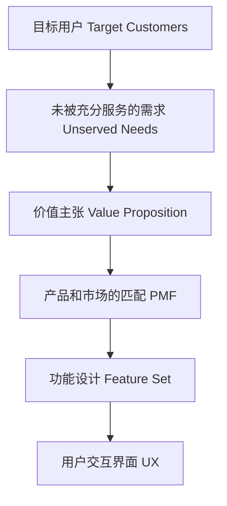
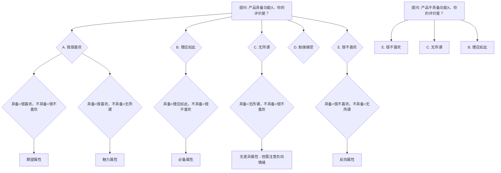
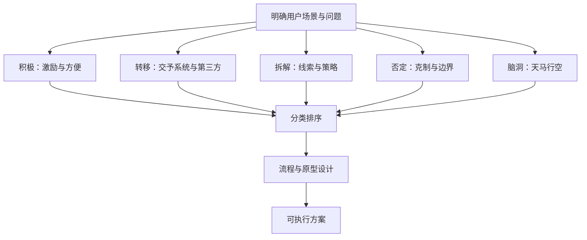

# 产品经理需求分析课程 — 详解笔记
> 视频作者：  | 平台：text | ❤️ 0

## 本节概览
本节内容作为产品高手创造营的第一课，深入阐述了“需求”为何是一切产品最核心的基石，并引入PMF（产品与市场的匹配）模型来解构产品逻辑。课程重点讲解了用于需求分类与量化的核心利器——Kano模型及其五种属性（必备、期望、魅力、反向、无差异），并通过问卷判定法与Better-Worse系数，建立了一套从挖掘用户需求到确定优先级的完整“需求挖掘五步法”。最终，讲师通过拆解微信核心路径、分析胖东来服务案例，以及运用HMW（How Might We）思维框架，将理论落地为可执行的优化方案，揭示了如何通过精准满足需求来减少工作中的无用功。

## 关键术语表
| 术语 | 解释 | 关键表述 |
| :--- | :--- | :--- |
| **PMF** | Product Market Fit，即产品与市场的匹配。指产品功能与目标用户未被满足的需求之间高度契合的状态，是决定产品生死的关键。 | “打造产品的关键，就是让产品和市场像两个齿轮一样紧密咬合在一起。” |
| **Kano模型** | 一种对用户需求进行分类和优先级排序的量化工具，通过判断功能具备与否对用户满意度的影响，将需求分为五类属性，旨在识别真正的价值和避免无用功。 | “Kano模型便是一套精准的‘无用功探测器’。” |
| **必备属性** | 用户视为理所当然的功能。提供不会提升满意度，但不提供会造成满意度急剧下降，是产品的底线。 | “你做的再好，用户的满意度并不会提高，但如果你不去做它，用户的满意度会因此降低。” |
| **期望属性** | 用户明确期望的功能。提供则满意度提升，不提供则满意度下降，是产品体验改善的确定性杠杆。 | “你有我优，你无我走。” |
| **魅力属性** | 超出用户预期的惊喜功能。不提供满意度不变，一旦提供则会极大提升用户满意度和口碑，是引爆传播的关键。 | “大家想象不到居然可以这样玩儿。” |
| **反向属性** | 用户根本不想要的功能，提供反而会导致满意度下降。 | “用户完全没有这个需求，提供之后满意度反而会下降。” |
| **无差异属性** | 用户完全不在意的功能。无论提供与否，对满意度都没有任何影响，是资源浪费的重灾区。 | “用户不在乎才是最可怕的。” |
| **Better-Worse系数** | 用于量化需求优先级的两个指标。Better系数（SI）衡量“增加功能后的满意度提升程度”，Worse系数（DSI）衡量“去掉功能后的满意度恶化程度”。 | “我们所有的产品都是在趋利避害，这个的差值，其实就是我们应该去考虑应该放在哪个象限的事。” |
| **HMW** | How Might We，即“我们如何能够……”。一种开放的、不设限的头脑风暴方法，通过积极、转移、拆解、否定、脑洞等维度，为已知问题探索各种可能的解决方案。 | “HMW鼓励一种开放、积极、不设限的团队共创，相信任何问题都有无数解法。” |

## 一句话总结
做产品的核心是精准识别并满足需求，通过Kano模型和需求挖掘五步法，可以量化地滤除95%不创造业绩的无用功，将资源聚焦在真正能提升用户满意度的必备、期望与魅力属性上。

---

## 逐节详解

### 产品高手创造营第一节：需求分析读心术 - 为何需求是一切产品的基石

课程伊始，讲师便开宗明义地将“需求”推至整个产品思维体系的中心位置。他带领我们回顾了前一节课对于产品本质的定义：

> 产品是什么产品？就是指能够供给市场被人们使用和消费，能满足人们需求的任何东西。它可以是有形的物品，无形的服务组织观念或它们的组合，这些都可以是产品。

在这个定义里，“供给市场”和“被人们使用消费”在当今商业环境中大多已处于默认满足的状态，真正决定产品生死的只有一个环节——**满足人们的某种需求**。正是基于这一洞察，讲师引出了一个贯穿产品工作的核心框架：PMF，即 **Product Market Fit（产品与市场的匹配）**。这个模型告诉我们，打造产品的关键，就是让产品和市场像两个齿轮一样紧密咬合在一起。

为了更好地阐述 PMF 的结构，讲师借用了一张层层递进的逻辑图。这张图的根基是 **Target Customers（目标用户）**，也就是我们在为谁做产品，他们可能是某个年龄段、性别或特定地域的群体。在这些用户的身上，一定存在着一些 **Unserved Needs（未被充分服务的需求）**。只有当这些“尚未被满足”甚至“尚未被清晰表达”的需求真实存在时，我们才能从中提炼出产品的 **价值主张**，从而完成产品与市场的匹配。而正是在这个价值主张之上，才会派生出我们平时最熟悉的 **功能设计（Feature Set）** 和 **UX（用户交互界面）**。讲师特别提醒初学者，千万不要将交互界面等同于产品本身：

> 有一些同学初入产品的岗位的时候会特别痴迷于某些具体的页面交互流程样式。其实这些只不过是产品的一些细枝末节的一些元素，而和我们的一个完整的谈得到产品的一个结构，相去甚远。

这句话如一记警钟，揭示了产品的灵魂在于其解决需求的能力，而非华丽的外衣。为了夯实这个观点，他举了 12306 火车票订票软件的例子：早期的 12306 界面粗糙，交互逻辑甚至有些反人性，但因为它能够真正满足人们在春运期间“一票难求”的刚需，用户依然心甘情愿地守在电脑前不断刷新。这个极端的案例证明了：

> 产品最核心的一定要考虑到需求，所以需求本身就是所有产品最基础，最核心的那一颗柱石。

这一逻辑还被推而广之到职场和人生场景中——每个人在职场上也是一款“产品”，需要满足企业和部门的业务需求才能获得发展；在人际交往中，考虑并满足对方的需求则是建立信任、达成合作的关键。这一层的类比，将“需求”二字从产品方法论拔高到了普世的处世智慧。

以下是 PMF 核心结构的可视化呈现，它将帮助我们在脑海中构筑起从用户到界面的完整逻辑链条：



在点明了需求的核心地位之后，讲师给出了本章的完整学习地图。本章“初心需求分析读心术”共分为四个部分：第一部分是基础篇，即今天要探讨的“用户需求应该如何挖掘与探索”；第二部分是进阶篇，讲解如何通过竞品分析来寻找产品的提升体系；紧接着的两节是高阶内容，一节聚焦于如何通过深度理解需求来改变用户习惯、打造高留存产品，另一节则旨在破解如何让产品自带传播属性，从而在获客成本异常高昂的当下，摆脱单纯依靠推广的被动局面。

### Kano 模型：为需求贴上五类属性的量化手术刀

正式进入“用户需求挖掘与探索”的基础篇后，讲师拿出了他所喜爱的核心利器——**Kano 模型**，并搭配“How might we”体系来拆解用户所需。他强调 Kano 的应用场景极其广泛，不仅可以用来确认某个需求是否客观存在、判定其优先级高低，更能从根本上减少那些“高付出、低回报”的无用功。

> 我们非常多的痛苦都源于我们在工作中做了一些，其实并没有给你带来实际收益的一些事情……我们从来不计较高付出和高回报，我们为什么有的时候感觉受挫，甚至想去躺平？就是我们做了很多高付出，但低回报的事儿。

他提醒我们反思，这种无力感究竟是源于分配机制，还是因为自己所做的事情本身就不产生实际业绩。Kano 模型便是一套精准的“无用功探测器”。作为一个酷爱量化工具的讲师，他认为 Kano 的魅力恰恰在于它是一个有效的量化模型，能够像科学一样数字化地解释问题，而非依赖纯粹的定性感觉。随后，他带领我们重温了 Kano 模型的五种属性分类，并用爱奇艺等案例做了生动诠释。

- **必备属性**：它的特征是不管如何优化，用户的满意度都不会提升，但一旦缺失，满意度则会断崖式下跌。讲师以爱奇艺的“流畅播放”为例，用户觉得这是天经地义的事，做得再好也不过是“理应如此”。然而：

  > 你做的再好，它的用户的满意度并不会提高，但你能因此而不好好做吗？不能因为如果你不去做它，它的用户的满意度会因此降低。

  在当时，卡顿甚至成为爱奇艺 CTO 的核心 KPI，这就是必备属性的底线意义。

- **期望属性**：这个属性的核心是“你有我优，你无我走”，提供了则满意度提升，不提供则满意度下降。例如，视频产品的“内容丰富度”就是典型的期望属性。用户希望看到尽可能多的内容，内容的多少直接决定了他们是否会用脚投票，转向竞争对手的平台。

- **魅力属性**：它被形容为意想不到的惊喜。如果缺失，用户满意度不会下降，因为用户本来就没指望；但一旦提供，便会带来极大的满意度跃升和主动传播。微信红包就是一个教科书般的案例，“大家想象不到居然可以这样玩儿”，于是引爆了全民级的互动狂欢。讲师将此延伸到综艺领域，《我是歌手》让成名已久的歌手以 PK 形式重返赛场，《乘风破浪的姐姐》让功成名就的艺人用组男团女团的方式出道，这些意料之外的设定创造了巨大的话题性和自发传播。

  > 综艺是否有魅力属性决定了它的宣发的效能是否高，而效能是否高了之后就会有大量的流量，大量的曝光。才能有广告的金主爸爸进行相应的冠名植入和赞助，才能够让这个综艺继续走下去。

  所以对于内容产业而言，魅力属性几乎等同于生死线。

- **反向属性**：用户完全没有这个需求，提供之后满意度反而会下降。广告便是最典型的一种。对于与商业模式相关的反向属性，我们不得不做，但需要寻找某种平衡，把它做得更柔和；但如果一个反向属性与“恰饭”完全无关，那就必须果断砍掉，因为它是一种“损人不利己”的存在。

- **无差异属性**：这是最值得警惕的“沉默杀手”——无论提供或不提供，用户的满意度都不会有任何改变，因为用户根本不在意。讲师举例爱奇艺的“泡泡流量”，无论怎么强推，用户始终不买账，最后关停时对核心指标也毫无影响。

  > 用户不在乎才是最可怕的，所以。有一天把这样的产品关停了，用户在乎吗？流量会变吗？其实是不会变。

基于以上分类，讲师给出了需求优先级的黄金排序：**首先要守住必备属性，这是产品的底线**，连流畅都做不到，再丰富的内容也是枉然。**其次要竭力做好期望属性**，因为它是确定性的，只要投入就能带来体验提升。魅力属性虽然效果惊人，但它往往是可遇而不可求的，很难有固化的方法论保证其产出，只能依赖创造力去挖掘，因此优先级排在第三。随后，要极力避免与商业无关的反向属性，让与商业模式有关的反向属性（如广告）通过提示、倒计时、可跳转等方式变得更柔和。最后，下定决心不要在无差异属性上浪费一丁点时间和资源。

### 问卷判定法：用两个问题锁定每个需求的 Kano 坐标

如何将任何一种需求精准地归入 Kano 的五类属性中？讲师给出了一套标准化的问卷判定法，通过两个简单问题和一个对照表，就能将感性的感觉转化为理性的坐标。

首先，针对任何一个功能或需求，我们都可以这样设计问题，并以微信的朋友圈功能为例进行练习：第一个问题是“如果你使用的产品**具备**这个功能，你的评价是什么？”，选项分为 A. 我很喜欢，B. 理应如此，C. 无所谓，D. 勉强接受，E. 我很不喜欢。第二个问题是“如果该产品**不具备**这个功能，你的评价又是什么？”，使用同样的 ABCDE 选项。接着，把这两个答案的交集代入到一个二维矩阵表格中，就能得出该功能的属性分类。

讲师通过对几张表格的讲解，演示了三种典型结果的推导过程：如果“具备”选 A（我很喜欢），“不具备”选 E（很不喜欢），则行列交叉的结果是 **O**，即期望属性。这说明该功能“有你很喜欢，没有你很不喜欢”，是体验改善的确定杠杆。如果“具备”选 B（理应如此），“不具备”选 E（很不喜欢），结果则为 **M**，即必备属性。这说明用户视其为理所当然，没有就会产生强烈负面情绪。而如果“具备”选 A（我很喜欢），“不具备”选 C（无所谓），结果则是 **A**，即魅力属性。这正是那句“有了会觉得特别棒，没有也无所谓”的典型特征，它能极大地拔高体验，却不会因缺失而拉低评价。

为了将这一抽象的二维判定流程变得更加一目了然，我们可以借助下面的 Mermaid 图来对其进行梳理，它将“具备/不具备”的分支与五种属性结论直观地连接在一起。



(Note: 实际课程的矩阵包含所有25种组合，上图仅提炼了关键的几条逻辑路径。)

通过这套工具，我们得以摆脱主观臆断，用结构化的方式看到每个功能的真实属性。讲师最后留了一个随堂练习，让大家尝试用同样的方法去评判“一个新产品推出了会员系统”在用户心中的属性定位，旨在通过不断实操来强化这种分析本能。当你能熟练地将任何需求填入这张量表时，你便掌握了辨识需求真伪与价值的读心术，从而能够从源头过滤掉那 95% 不创造实际业绩的伪工作。这种能力不仅适用于产品设计，也同样是提升个人职场价值与受欢迎程度的一把钥匙。

### 运用KANO模型进行需求分类的量化与优先级排序

在明确了KANO模型中单个用户对于功能属性的判断逻辑之后，讲师引导我们思考一个更现实的困境：即当面对多个用户时，意见往往是分裂的。他用一句莎士比亚的名言来比喻：>100个人心中有100个hamlet，那么如果100个人，他的这个选择结果不一样又怎么办呢？如果众口难调。解决这一“众口难调”问题的关键，就在于对大量用户的反馈进行统计和量化分析。

讲师以一个具体的微信朋友圈功能调研为例，展示了这一过程。假设我们对2209个人进行调研，收集他们对于“有朋友圈”和“无朋友圈”的感受。统计结果会呈现出一种分布：可能有3个人选择某个组合，25个人选择另一个，97个人在这里，187个人在那里。我们需要做的，就是>将所有的a的集合……总体计算为魅力属性的数量，并且除以二零九就可以得到分别在每一个板块上它相应去占比的比例。通过对所有用户选择结果的归类，我们可以计算出在A（魅力属性）、O（期望属性）、M（必备属性）、I（无差异属性）等各个象限上的人数占比。当某一类属性的占比显著高于其他类别时，我们就可以据此判断该功能在目标用户群体中的整体属性趋向。例如，如果大部分用户的选择结果都落入M（必备属性）区域，那么我们就可以得出结论：>在目前朋友圈在你调研的用户群体中，它更加趋于必备属性的特质。

然而，仅仅知道一个功能是必备属性并不足以在多个需求之间作出精准的排序，因为很可能出现>三到四个都是必备，两到三个都是期望的情况。这时，我们就需要更精细化的工具来区分优先级。由此，讲师引入了第三层计算方法：Better-Worse系数分析。

Better-Worse系数从“增加某功能后体验的改善程度”和“去掉某功能后体验的恶化程度”两个维度，对需求进行量化打分。其中，Better系数（SI）的计算公式是>(A+O)÷(A+O+M+I)。它的逻辑在于，魅力属性（A）和期望属性（O）都属于“有则加分”的正面体验，因此分子是A与O之和。它衡量的是提供该功能能为用户带来的满意度提升。而Worse系数（DSI）的计算公式是>(M+O)÷(A+O+M+I)，然后乘以负一。其逻辑是，必备属性（M）和期望属性（O）一旦缺失，会引发用户的强烈不满，造成体验下降，因此分子是M与O之和。它衡量的是不提供该功能会导致的用户满意度下降程度。讲师总结道：>我们所有的产品都是在趋利避害这个的差值，其实就是我们应该去考虑应该放在哪个象限的事。

当面对功能1、2、3、4、5等多个需求时，我们就可以利用SI和DSI的值来构建一个优先级排序的四象限图。这个图的构建方法是：首先，计算所有功能SI值的平均值，并将其作为横坐标轴；然后，>再去取五个，它分别的dsi的绝对值……五个的绝对值的平均值，作为它的纵坐标轴。这样，我们就得到了一个由SI和DSI平均值构成的坐标系。接下来，将每个功能根据其自身的SI和DSI值，像坐标点一样填入这个象限中。通过这种比较优势下的再定位，原本单体看来可能属于不同属性的功能，会在象限中呈现出清晰的优先级。最终的排序原则是：>先做必备，再做期望，再做魅力无差异，不做然后在同一个象限中，先做better值更高的一个需求。这套方法要求我们在资源有限的情况下，即使是同属必备属性的功能，也要优先去满足那些Better值更高、即提供后满意度提升更明显的那一个。

至此，讲师系统性地总结了从用户需求挖掘到确认优先级的一整套流程，即“需求挖掘五步法”。第一步是提出问题，使用两个标准问题：>有了你会怎么想？没有你则会怎么想？第二步是收集反馈，采用一个五维度的李克特量表，让用户从>我很喜欢，理应如此，无所谓，勉强接受，我很不喜欢中进行选择。第三步是分析归类，将两个问题的答案代入对照表格，找到该用户对该功能的属性判断。第四步是进行多人统计计算，如果涉及大量用户，就要通过统计不同属性选择的比例，并计算Better-Worse的SI和DSI值，来比较其优劣势。第五步是多需求综合比较，将所有功能放入由SI和DSI均值构建的四象限表格中进行最终排序。

讲师特别提醒，这套方法最核心的防范之处，就是要识别并避免职场中大量的“无用功”。他将“无用功”与加班文化联系起来，指出：>加班比加班更痛的是什么？是加班之后业绩本质上并不提升。而导致这一现象的本质原因，从KANO量表的统计概率上看，是大量的工作都落入了无差异属性（I）的范畴。>I的本质是无差异属性。它从比例上是最多的，所以正是因为它最多。因此，从概率上讲，我们很多时刻做的事情都没有特别大的价值。他建议我们要将KANO模型内化为一种思维方式，时刻反思手头工作的价值，思考如何把时间用在对用户、对自身更有价值的地方。

### 案例拆解：微信的核心体验路径与属性分析

为了让我们更深刻地理解这套复杂的产品分析方法，讲师以微信这一“非常大体系”的产品为例，进行了完整的分析拆解。他强调，无论一款产品的规模多么庞大、体系多么庞杂，它都>必然有其核心路径，拆解核心路径是对于我们思考清楚一个产品如何去做优化极其关键的一个环节。

```mermaid
graph TD
    A[微信核心路径] --> B[好友关系]；
    A --> C[聊天沟通]；
    C --> D[一对一]；
    C --> E[群聊]；
    C --> F[聊天功能]；
    C --> G[聊天内容]；
    C --> H[其他周边功能]；
    F --> F1[文字]；
    F --> F2[表情]；
    F --> F3[视频]；
    F --> F4[红包]；
    F --> F5[语音]；
    F --> F6[辅助功能: 摇骰子/群接龙]；
    G --> G1[公众号]；
    G --> G2[小程序]；
    G --> G3[视频号]；
```

首先，他梳理了微信的核心路径。整个微信的核心是>好友的关系，聊天的沟通。而聊天的沟通又可以拆解为一对一和群聊。在此基础上，延伸出聊天的功能，包括文字、表情、视频、红包、语音以及其他辅助功能（如摇骰子、群接龙）。这些功能承载的则是聊天的内容，如公众号、小程序、视频号等。这是一个层级清晰的完整体系。

接下来，我们可以结合KANO模型，对这条核心路径上的各个功能模块进行属性判断。通过扪心自问或市场调研，思考每个功能“有”和“无”带来的体验差异。讲师给出了一个可能的分析结果：>好友关系是必备，聊天沟通一对一是必备，群是必备。文字是必备，视频是期望……红包在某些时刻可能是一个这个魅力属性。这个分析帮助我们看清了微信这座大厦的根基和支柱。必备属性是产品的基石，是短期内难以做出颠覆性优化的部分。无差异属性则是需要我们果断避开、不要浪费时间的“陷阱”。魅力属性则是一个流动的概念，因为>魅力其实是已经做好了，做好的瞬间，其实它已经变了另外一种形态。用户一旦习惯并感知到魅力属性的价值，它就可能向期望甚至必备属性转化。

这之中，>期望属性是很大程度上我们是可以去做需求功能体验改善的。因为期望属性直接关联用户满意度，做得越好用户越满意，做不好则会带来失望。因此，在微信这个案例中，像自建表情、视频通话、语音通话以及在聊天内容中更好地呈现公众号等，都成了最容易找到优化点的方向。

### 寻找优化方案的思维框架：HMW方法

找到了可优化的方向（如公众号在群聊中的内容匹配），下一步就是如何构想出具体的优化方案。为此，讲师引入了HMW方法，即>how might we，我们如何能够……。这个方法的核心精神在于>h是假设我们提出的问题都是可以解决的，只是我们尚未知道怎么去解决。might是暗示现在讨论想法不用太完美，大概有一些方向性的东西……v呢，其实要依靠整个团队的力量来去解决。HMW鼓励一种开放、积极、不设限的团队共创，相信任何问题都有无数解法，我们要避免过早地被现有技术和条件的可行性限制了思路。

这一方法论在实践中分为五个步骤。第一步是>明确用户场景和问题。讲师以微信群聊中的公众号阅读体验为例，精准定义了用户场景和痛点。>核心的用户在25到35岁之间，场景就是群内的聊天场景。而痛点则是一个我们非常熟悉的画面：>群内转发的公众号内容太多，而公众号很多时候标题党严重……信息的有效率在降低，信息的杂质太高。因此，我们可以清晰地定义要解决的目标：>通过群内公众号精准匹配，来去提高我们的在群内聊天过程中信息的有效率问题。

第二步便是问题的拆解，这是HMW的核心，讲师称之为一种“开脑洞的框架”。它通过一些特定的维度，强制将我们的思维发散开来，从而进行系统性的思考，其中一种重要维度便是>积极转移。积极，就是>给用户好处。它的目标是>让用户体验到你的好，给到他不同的好处来去使得用户的体验变高。在这一环节，我们完全不用考虑技术可行性和现有功能的限制，这是为了避免任何可行性的考量>制约你的产品的思路。

以“如何让用户愿意转发精准匹配的公众号内容”为例，“给用户好处”这个大方向下又可以细分出多种路径。我们可以思考：>如何让用户转发精准公众号的内容之后，它能够有好处。因为问题的根源可能在于用户转发时，内容的价值度本身就不高。如果系统能通过算法（如基于打开率、留存时长等指标）识别出精准匹配的内容，并反过来给予转发者激励，那就能从源头解决问题。这就衍生出了许多创新的解法，例如>转发了精准公众号有红包，或者采用生态性的打法，让内容创作者为其内容被精准传播而向传播者付费，亦或是>转发公众账号内容精准之后，能够有抽奖。这些天马行空的构想，在传统基于竞品分析的思考框架下是很难产生的，这正是HMW方法的价值所在。除了直接给好处，HMW还鼓励我们从“给用户方便”、“让体验变得更有趣”等多个维度进行转移和拆解，从而穷尽所有可能的优化方向。

### 通过积极手段与生态打法驱动精准传播

关于如何让用户更主动地传播精准内容，我们可以跳出原有的思维框架，尝试用反向激励和生态联动的方式给予刺激。直接的物质奖励或虚拟权益往往能带来立竿见影的效果，比如> 转发了精准公众号有红包，系统给积分，或者转发后能够参与抽奖。这种机制把传播行为游戏化，让分享本身就变成一种可获得即时满足的动作。更进一步，还可以构建生态性的打法，让创作者与传播者之间直接建立利益关联。比如> 公众号的作者，他的内容被转发到一些精准的群里之后，他可以用一种类似于广告付费的方法给到这些传播者，而不一定通过给到广告平台。这样，流量分发就不再只依赖平台的中心化推荐，而是通过真实的、被认可的小圈子扩散出去，传播者获得了回报，作者也获得了精准读者，形成双向良性的循环。

### 为用户创造方便与有趣的体验

让用户感到“方便”是增加产品黏性的核心思路。在群聊场景中，搜索历史聊天记录里的公众号文章一直以来都不太顺手，但> 我们可以通过语音来去搜索群内的公众号，这种交互上的减负直接提升了内容获取的效率和价值感。同时，系统还可以主动帮用户做信息的筛选和整理，比如> 通过一些长时间的机器学习的方式了解到你们经常聊的是什么主题，当一个从来没有发过公众号的新成员突然丢出一篇文章，而文章的风格和群内整体调性明显不符时，系统可以自动将其屏蔽。这实际上是一种极为体贴的“免打扰”设计，用户甚至不需要去手动操作，群聊的沉浸感就得到了保护。至于让体验更有趣，可以在群内引入即时反馈机制，比如> 对于群内发一个内容，大家可以对于他进行踩和赞，对标题党信息，群主可以给他关一个小黑屋。这种低门槛的全民治理让每一位成员都有了参与感，也让内容的筛选变得更加柔性且有趣。

### 转移：把问题交给系统或第三方去解决

有时，最优的方案并不是直接让用户去做什么，而是把难题转移出去。“转移”的逻辑是指> 你不去做这样一个事情，或者叫做不需要用户去做这样一个事情，而是把这样一个问题交给第三方或者交给系统来解决。例如，不要求用户自己去甄别高质量公众号，而是通过系统的智能推送，在群内恰到好处地给予引导，让用户自然被触动。我们还可以> 让用户乐于主动找到什么样的才是符合群内调性的精准的公众账号，甚至可以针对群本身的不同价值程度，通过不同操作维度进行更细致的运营，赋予群管理者相应的权力表征。这样一来，管理者和活跃成员本身就变成了传播精准内容的自发节点，他们为了维持群的高质量，会主动进行筛选和分享，从而把“如何让内容精准”这个难题，转移给了群生态自己。

### 否定：通过克制确立产品的边界

> 否定这个词，大家初听的时候可能会觉得比较有压力，但事实上任何的一款产品我们可以讲它的克制与它的一些边界感是完成一款产品非常重要的一些环节。“否定”就是要敢对某些行为说不，哪怕是让用户“不得不”去做一些事来保证内容质量。例如，> 让用户在去转发一条内容的时候，他必须要去写出来他相应的推荐语。这看似提高了操作门槛，却自然筛掉了随手转发的噪音，让每一次转发都带着思考和背书。同时，否定思维也包含“不做转发也能达成目的”的路径，也就是思考> 如何能够让用户不去通过这样的一些转发的行为，依然能够通过群内的其他系统故事或者其他方式，看到和聊天上下文相关的内容。当不转发就能获得匹配的信息流时，那些低质量的硬性转发就自然失去了动机，这正是克制带来的生态净化。

### 拆解：从线索到策略的精细化界定

“拆解”是行动前的精密侦察，它的核心是> 我们如何能够通过一些什么样的线索来达成我们一些什么样的逻辑与策略。所谓精准与否，不能停留在感觉层面，而要拆解成可度量的行为信号。比如> 一条内容的完整观看比例非常低，也有可能是打开之后停留时长非常短，那这种内容我们就有可能将它标示为低质量或者标题党内容，从而做系统性降权。但情况并不总是一刀切，可能在某些群里，一部分人看得很深入，另一部分人却很快划走。这时候就需要对不同的人群打上标签，在内容发送后> 根据协同过滤或者一些相关性算法规则进行详细匹配。这样，同一个内容在不同的人面前就会呈现出不同的权重，精准匹配不再是一种模糊的感受，而是一套可迭代的策略体系。

### 脑洞：天马行空的情感释放与思维突破

在所有扎实的分析之后，必须留出一个不受约束的“脑洞”环节，把那些“一厢情愿”的念头全部放进来，为解决方案注入出人意料的灵感。比如一个看似荒诞但极具杀伤力的思路：> 转发非精准内容，系统识别之后自动屏蔽，别人看不到，但是自己还认为自己发出去了，再过一段时间可能给这类的用户进行一个在评分上的降权，使得它可能在一些新加群或者另外一些行为上就受到若干限制。这种“温柔”的惩罚机制，既不过分激怒发送者，又悄悄稀释了他的传播影响力，通过幻觉维持来降低其继续滥发的动力，为广告拦截和群聊净化提供了一种戏谑但可能极为有效的路径。这五个步骤——积极、转移、拆解、否定、脑洞——共同构成了一个把需求转化成可执行方案的思维方式，之后再进入分类排序、流程与原型设计等更具象化的产品推演阶段。



### 胖东来的诞生与“真品换真心”的底色

胖东来是一家扎根于河南许昌和新乡的本土零售企业，它的起点是1995年的望月楼胖子店，创立之初就立下了> 用真心换真品，用真品换真心的承诺。在1998年，一场地痞的报复性纵火几乎让创始人于东来倾家荡产，店铺烧尽，八名员工遇难。然而正是他长期用实诚积攒下的信誉，在最绝望的时刻托住了他。> 五月一号的时候，因为他的所有的顾客已经养成……他的很多的顾客主动的借给他钱。一位老大娘拿出两万块养老钱让他别趴下。被无数普通人挽留的于东来选择重生，自此胖东来便带着一种近乎执拗的真诚，一路成长。2005年进驻新乡时，身处沃尔玛和世纪联华的夹击，连停车场都没有，所有人都断言那块三角地无法生存。结果> 十一年后，围绕着胖东来的三家超市全部退出。2016年胖东来重新自建商场营业一小时就被迫暂停营业，因为满城的人都涌进来，警察只能维持限流。它走后，后来涌入的商场又纷纷倒闭，证明了地段不是传奇的主因，胖东来自身才是。

### 把服务做成魅力属性的极致体验

胖东来的价格策略异常透明，> 它的所有标价上标上进货价，公开自营产品的毛利率最高只得20%，未来不允许超过25%的毛利率。这种坦诚在零售业极为罕见，直接建立起一种“不设防”的信任。而真正让顾客口口相传的，是那些你在任何一家超市都不曾期待过的服务，它们恰好就是卡诺模型中的魅力属性。> 购物车有七种样式，有老人和儿童款，你不做没有人管你，也不会降低体验，但你做了就会成为口口相传的店。免费修衣服、家电、珠宝清洗，即便不是在胖东来买的也可以享受；熟食区配微波炉和真空机方便打包；雨伞、充电宝免费租借；随处可见的冷热水饮水机、洗手台、免费座椅和自行车存放处；直梯里有专门的服务人员，连柚子皮都帮你剥开。还有一个令无数人温暖的小细节：> 101到109的商品只收100块钱。七天无理由退差价更是把后悔成本降到零。对员工，它同样造就了反差巨大的魅力体验：不允许加班，员工之家有电影院、健身房，吹风机是戴森，没顾客时可以坐着玩游戏；在三线城市新乡，它给出的工资比同行翻倍，员工每天最多工作六小时，管理层的每年必须出门旅游20天，不出去就免职，因为于东来相信人要> 感知生命的美好，不能像机器一样浪费生命的价值。

### 从业务链路中挖掘可优化的节点

要理解胖东来的成功并迁移到我们自己的产品中，需要先把它的核心业务链路拆解开来：用户如何被吸引过来、怎样在店中寻找和选择商品、购物和结账的流程是什么、如果退货又是怎样一种体验，以及这些正面体验如何被顾客主动口口相传。在每一个环节上，我们都可以放上卡诺模型的那张表格，去判断胖东来已经做到了哪个状态——哪些是理所当然的基本型需求，哪些是性能型期望，哪些又是让它一夜封神的魅力属性。找到这些高光点之后，再用HMW方法，对于“如何让进店理由更有魅力”“如何让结账等待变为一种享受”“如何把退货变成再次传播的契机”之类的问题，经由积极、转移、拆解、否定和脑洞五步进行优化。这个过程不仅是对胖东来的复盘，更是对自身业务的一次深度问诊和灵感注入。

### 生活中的卡诺：送礼物与舔狗现象的深层剖析

这套思维完全可以应用到日常人际关系中，尤其是送礼物这件事。知乎上有一个很吸引眼球的问题“你收到的最奇葩的礼物是什么”，其中一个姑娘提到男友把他自己穿过的睡裤送给她当情侣衫，另一个姑娘则收到了心仪男生送的卸妆水。这些送礼失败案例的根源，在于送礼者沉浸在自己的逻辑里，误以为某个物品代表着深情，却完全忽略了对方真实的卡诺归类。> 送礼物应该尽量送魅力属性的东西。不送的时候对方觉得无所谓，完全没想过要拥有；而一旦送出，对方喜出望外，这就产生了情感溢出的峰值体验，成了可以“撒狗粮”的美好记忆。相反，如果你送了一个对方勉强接受的东西，不送他却觉得本应如此，场景就会变得尴尬。这也就解释了> 为什么舔狗到头会一无所有，因为舔狗往往在拼命付出大量无差异属性甚至反向属性的行为，自己眼里是魅力属性，对方眼里是反向属性，完全变成了感动自己、恶心别人。所以无论是做产品还是与人相处，必须时刻觉察：> 你想要的，不一定是对方想要的。只有站到对方立场，思考对方真正需要什么，先给予对方足够的价值，才能最终完成自己想要的交付。这种“我为人人，人人为我”的思维，正是产品思维最温润的底色。

### 总结：Kano模型与需求挖掘五步法的融会贯通

Kano模型最宝贵的价值在于它能帮助我们用两个极其简单的问题，快速判断一个需求是否真实存在，无差异属性根本不是需求；同时确定需求的优先级，区分出基本、期望、魅力等不同等级，减少资源浪费，并精准找到能够打造爆款的魅力属性。需求挖掘的五步法则是从正反两面提出问题，代入横纵轴表格进行归属判定；当多人意见众口难调时，就做统计归纳，寻找普遍规律；再通过满意度系数和不满态度系数进行优劣势比较；最后结合多需求四象限，在全局视角下完成最终的比较分析。紧接着，把我们找到的期望属性和可优化环节放到整条业务链路里，应用HMW的五个步骤——积极、转移、拆解、否定、脑洞——发散出大量构想之后，再进行分类排序、流程设计和原型落地，最终实现问题的彻底解决。胖东来的故事、送礼物的例子，都是这套思考方式的真实投影，它提醒我们永远要以对方的真实感受为原点，去设计体验、去给出善意。