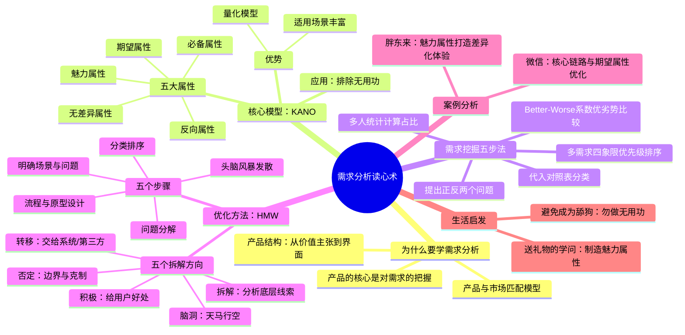
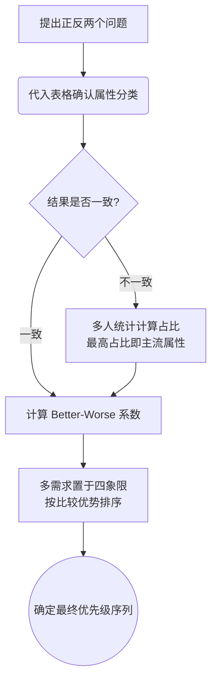

# 产品经理需求分析课程 — 课后笔记

> 视频作者：产品高手创造营 | 平台：text | ❤️ 0
> 转录：本地 Whisper

---

## 内容框架图

---

## 核心论点

> 产品的核心关键在于对需求的把握。产品与市场的匹配是打造产品的最关键环节。

需求分析是所有产品工作的基石。通过 **KANO 模型** 量化需求等级，用**需求挖掘五步法**精准定位优先级，再结合 **HMW 方法**进行结构化优化，可以系统性地减少无效工作，聚焦真正产生价值的期望属性和魅力属性。

---

## 内容框架

### 1. 为什么需求分析是第一课？

课程开篇阐明，产品定义的核心是“满足人们需求的任何东西”。在产品结构中，底层是目标用户的未满足需求，然后才是价值主张、功能设计和用户界面。用户界面只是细枝末节，真正的产品本质在于满足需求，哪怕界面粗糙。这解释了为何需求分析是产品思维的基石。

> 产品最核心的一定要考虑到需求，所以需求本身就是所有产品最基础、最核心的那一颗柱石。

此观点被延伸至职场和个人发展：每个人在职场上也是一种产品，需要满足企业/部门的需求；与人建立关系，也需优先考虑对方需求。本章及本课程包含基础（挖掘探索需求）、进阶（竞品分析找提升）、高阶（改变习惯提高留存、打造自传播爆款）四个部分，本节是第一课的基础篇。

### 2. 核心模型：KANO 模型深度解析

KANO 模型是本课的核心工具，用于确认需求是否存在、划分优先级，从而减少工作中的无用功。它是一个量化模型，适用产品、运营乃至职场生活。模型将需求分为五类：

| 属性类型 | 特点 | 示例（视频产品） |
| :--- | :--- | :--- |
| **必备属性** | 提供后满意度不提升；不提供则满意度大幅降低。是产品底线。 | 视频流畅播放 |
| **期望属性** | 提供则满意度提升；不提供则满意度降低。是优化确定性最高的领域。 | 内容丰富度 |
| **魅力属性** | 不提供无影响；提供后满意度极大提高，引发口碑传播。可遇不可求。 | 微信红包、《我是歌手》赛制 |
| **反向属性** | 用户无此需求，提供后满意度反而下降。需区分是否与商业模式相关。 | 广告（商业模式相关）|
| **无差异属性** | 无论提供与否，用户满意度均不变。是最大的时间陷阱。 | 某些使用率极低的功能 |

> 过多的时间，太多的生命，太多的产品资源，其实都是在无差异属性上凭空浪费掉了。

**优先级排序逻辑**：
1.  先做**必备属性**（底线不破）。
2.  次做**期望属性**（确定性高，做则提升）。
3.  挖掘**魅力属性**（形成品牌心智与口碑，但不可强求）。
4.  避免与商业无关的**反向属性**，将与商业相关的反向属性做得更柔和。
5.  坚决不在**无差异属性**上浪费任何时间。

### 3. 方法论：需求挖掘五步法与 HMW 优化法

#### 3.1 需求挖掘五步法（判断需求等级）

这是一个从定性到定量的完整流程：

1.  **提出问题**：设计正反两个问题（如“如果微信有/没有朋友圈，你的感受是？”）。
2.  **代入表格**：用李克特五级量表（很喜欢、理应如此、无所谓、勉强接受、很不喜欢）收集答案，通过下面的对照表找到对应属性分类。

| 具备此功能 / 不具备此功能 | 我很喜欢 | 理应如此 | 无所谓 | 勉强接受 | 我很不喜欢 |
| :--- | :--- | :--- | :--- | :--- | :--- |
| **我很喜欢** | Q (可疑) | A (魅力) | A | A | O (期望) |
| **理应如此** | R (反向) | I (无差异) | I | I | M (必备) |
| **无所谓** | R | I | I | I | M |
| **勉强接受** | R | I | I | I | M |
| **我很不喜欢** | R | R | R | R | Q |

3.  **统计计算**：当多人结果不同时，统计每个属性（A/O/M/I/R）的占比，以最高占比确定该需求的主流属性类别。
4.  **系数比较**：对于同一属性象限内的多个需求，计算 **Better (SI)** 和 **Worse (DSI)** 系数进行优先级排序。
    -   **Better (SI) = (A+O) / (A+O+M+I)**：增加功能后的满意度提升系数。数值越大，代表改善效果越好。
    -   **Worse (DSI) = -1 × (M+O) / (A+O+M+I)**：去掉功能后的满意度下降系数。绝对值越大，代表影响越大。
5.  **四象限决策**：当有多个需求时，计算所有需求 SI 和 DSI 绝对值的**平均值**作为坐标原点，绘制四象限图。优先做象限右上方的需求（Worse 值高，Better 值也高）。在同一象限内，优先做 Better 值更高的需求。最终排序逻辑归为：**必备 > 期望 > 魅力 > 无差异**。

#### 3.2 HMW（How Might We）优化法

当定位到某个可优化的环节（特别是期望属性）后，使用 HMW 方法找到解决方案。

-   **核心思想**（HMW）：
    -   **H (How)**: 假设问题均可解决。
    -   **M (Might)**: 任何想法都可接受，无需完美。
    -   **W (We)**: 依靠团队力量。
-   **五大拆解方向**：
    1.  **积极 (Positive)**：给用户好处、方便或让体验更有趣。
    2.  **转移 (Transfer)**：将问题交予系统、算法或第三方解决。
    3.  **否定 (Negative)**：思考如何让用户不去做某件事，或用更优路径替代。
    4.  **拆解 (Dissect)**：分析问题底层的构成线索（如什么是“精准内容”？）。
    5.  **脑洞 (Wildcard)**：完全不受限的想象。
-   **五大步骤**：明确用户场景与问题 → 问题进行分解 → 发散思维头脑风暴 → 对方案分类排序 → 流程与原型设计。

### 4. 案例分析：理论与实践的结合

#### 4.1 微信：核心路径中的期望属性优化

微信的核心路径是“好友关系 → 聊天沟通 → 聊天功能/内容”。通过 KANO 模型分析该路径上的各功能，发现**好友关系、聊天**等多为必备属性；**视频、表情、公众号**等是期望属性，是具象的优化切入点。以“群内公众号信息有效率低”为例，运用 HMW 方法在“积极、转移、否定、拆解、脑洞”五个方向生成了多种可能的解决方案，如精准转发奖励、系统过滤标题党、群主禁言等功能，展示了从“发现问题”到“生成解决方案”的完整过程。

#### 4.2 胖东来：魅力属性驱动的差异化体验

胖东来超市在许昌、新乡等三线城市创造了商业奇迹，其核心竞争力在于通过大量**魅力属性**打造了极致的差异化体验。案例展示了它的魅力属性清单：七种购物车、免费服务（修衣、清洗珠宝，不限购买地）、熟食区配微波炉/真空机、大量免费便民设施、商品仅需百元、七天无理由退差价等。这些“不提供也没问题，提供了就带来巨大惊喜”的细节，共同构成了其强大的口碑壁垒，证明了魅力属性在建立品牌护城河中的巨大力量。

### 5. 个人启发：感受他人需求，提升受欢迎程度

本节将产品思维引入生活场景。

> 送礼物应该尽量送魅力属性的东西。

送礼是典型的用户需求满足场景。如果送的是对方的“魅力属性”（未期望却很喜欢），会带来巨大的情绪峰值和正向情感溢价。反之，若送出“无差异属性”甚至“反向属性”（如直男送奇葩礼物），则效果适得其反。

> 很多时候所谓的舔狗就是付出了大量无差异属性，甚至反向属性的工作……想要的不一定是对方想要的。

这生动解释了“舔狗”现象：一方自我感动地付出了大量对方眼中或无差异、或反感的行动。核心教训是：**必须站在对方的立场思考其需求，而不是以自我为中心。** 达成目的的关键在于通过提前给予对方价值，最终完成自己期望的价值交付。

---

## 关键概念

-   **产品**: 能够供给市场，被人们使用和消费，能够满足人们某种需求的任何东西，包括有形物品、无形服务、组织观念或其组合。
-   **PMF (Product Market Fit)**: 产品与市场匹配。指产品与目标市场未被充分满足的需求完美契合，是产品成功的基础。
-   **价值主张**: 为目标用户群提供的独特价值集合，是连接用户需求与产品功能的桥梁。
-   **KANO 模型**: 对用户需求进行分类和优先排序的量化工具，将需求分为必备、期望、魅力、反向和无差异属性。
-   **必备属性 (Must-be, M)**: 用户认为产品理所应当具备的功能。优化不会提升满意度，但不提供满意度会急剧下降。
-   **期望属性 (One-dimensional, O)**: 用户满意度和需求实现程度成正比的属性。做得好就满意，做得不好就不满意，是产品优化确定性最高的领域。
-   **魅力属性 (Attractive, A)**: 用户意想不到的惊喜点。不提供满意度不受影响，提供则满意度大幅提升，极易形成口碑传播。
-   **反向属性 (Reverse, R)**: 用户本无需求，提供后反而降低满意度的属性。需区分其是否与商业模式（如广告）相关。
-   **无差异属性 (Indifferent, I)**: 用户根本不在意的属性。无论提供与否，满意度均无变化，是资源浪费的重灾区。
-   **李克特量表 (Likert Scale)**: 一种常用的态度测量表，通常有5级或7级，如“很喜欢、理应如此、无所谓、勉强接受、很不喜欢”，用于量化用户的主观感受。
-   **Better-Worse 系数**: 用于在同属性象限内量化比较需求优先级的工具。Better (SI) 系数代表满足后的正向影响程度，Worse (DSI) 系数代表不满足后的负向惩罚程度。
-   **HMW (How Might We)**: 一种启发式问题解构与创意生成方法。核心理念是假设问题可解决、任何想法都可接受、依靠团队力量，通过积极、转移、否定、拆解、脑洞五个方向强制拓展思考边界。

---

## 个人思考

1.  **为日常工作建立“需求过滤器”**：接手任何任务前，都务必在心中用 KANO 模型做一次快速判断：“这个任务对公司/业务而言是必备、期望还是无差异属性？” 如果是无差异属性，尽量寻求合理的方式避免投入，将宝贵精力分配到高价值象限（必备>期望>魅力）的任务上，这是避免加班却无产出的根本。
2.  **优化工作从“期望属性”切入**：在产品规划中，不要总想憋大招（魅力属性）或掉进补齐基础的陷阱（必备属性）。最稳定、见效最快的优化路径，是系统梳理核心业务流程，找到那些用户“做好了就高兴，做不好就骂人”的**期望属性**，用 HMW 方法有章法地构思解决方案。
3.  **用数据而非直觉管理需求优先级**：遇到多需求并行时，停止“我觉得重要”的口水仗。应用五步法，哪怕是快速地在团队内部做一次小范围投票，并用 Better-Worse 系数进行四象限分析，也能将讨论从主观感觉拉回到客观数据的轨道上，清晰地揭示需求的比较优势。
4.  **在生活中践行“魅力属性”思维**：将魅力属性的概念应用到人际关系维护中。无论是给家人、朋友还是伴侣准备惊喜，都应去洞察对方“从未期待过，但得到会极开心”的事物，而非按自己的喜好行事。一次成功的魅力属性创造，远胜于十次平淡无奇的常规付出。